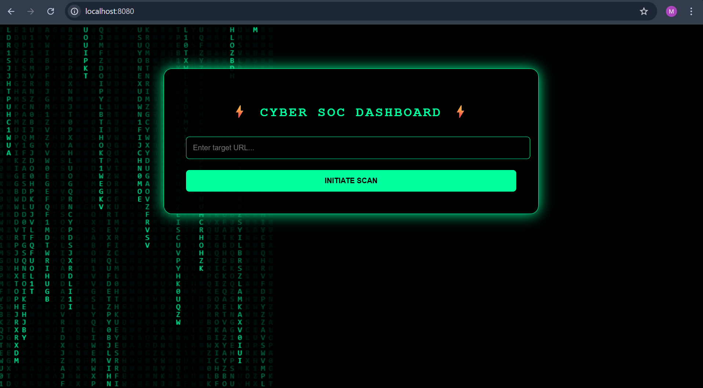

# 🛡️ Phishing URL Detection System

A web-based phishing URL detection system built using Spring Boot that analyzes URL security features and classifies them as Safe, Medium Risk, or High Risk using a rule-based risk scoring engine.

---

## 🚀 Features

- Detects suspicious URL patterns
- Risk scoring mechanism
- Classifies URLs into:
  - ✅ Safe
  - ⚠️ Medium Risk
  - ❌ High Risk
- Cybersecurity-themed user interface
- MVC architecture (Controller-Service structure)

---

## 🛠 Tech Stack

- Java 17
- Spring Boot
- Thymeleaf
- HTML / CSS
- Maven

---

## 🔍 How It Works

The system evaluates:

- HTTPS vs HTTP protocol
- URL length
- Presence of '@' symbol
- Suspicious keywords (login, verify, bank, update, etc.)

Based on these features, a risk score is calculated and classification is performed.

---

## 💻 Project Structure

## 📸 Screenshots

### 🏠 Homepage

### 🔎 Result Page

